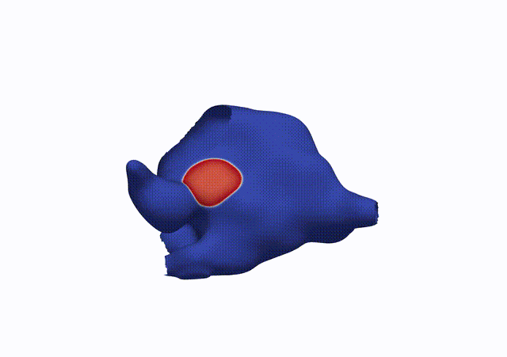
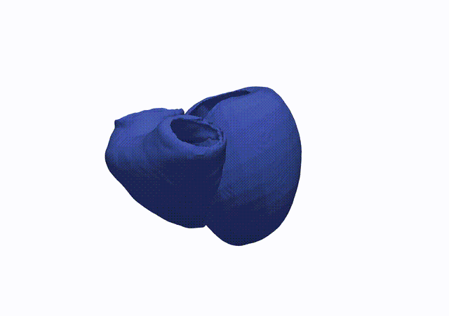
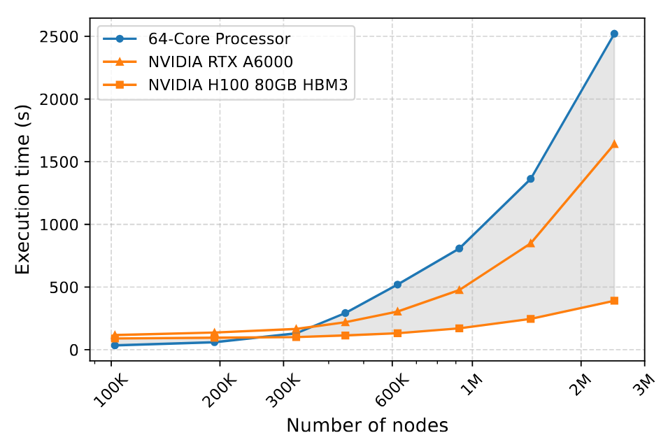
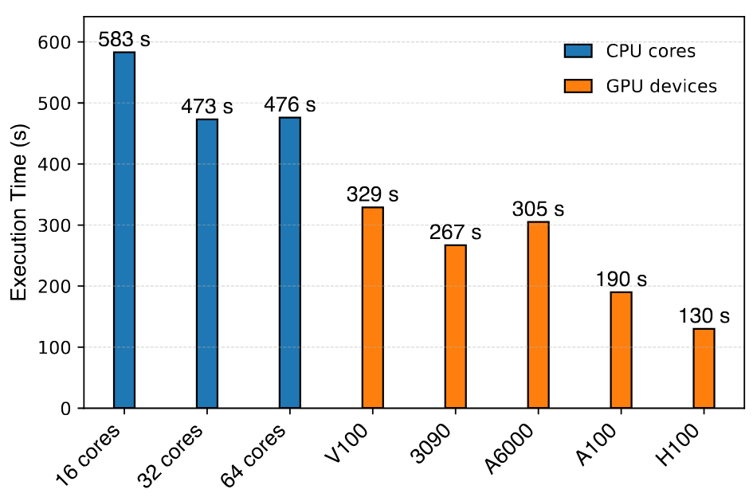

# TorchCor

**TorchCor** is a high-performance simulator for cardiac electrophysiology (CEP) using the finite element method (FEM) on general-purpose GPUs. Built on top of PyTorch, TorchCor delivers substantial computational acceleration for large-scale CEP simulations, with seamless integration into modern deep learning workflows and efficient handling of complex mesh geometries.

**TorchCor offers:**

- 🚀 Fast, scalable CEP simulations on large and complex heart meshes  
- 🔗 Seamless integration with PyTorch and scientific machine learning workflows  
- ⚙️ Support for a wide range of ionic models and conductivity heterogeneity  
- 🔧 Fully customizable model parameters for flexible experimentation and prototyping
- 🎯 Accurate simulation of cardiac electrical activity for research and development  
- 📈 Generation of precise local activation time maps  
- 🩺 Simulation of clinically relevant 12-lead ECG signals through phie recovery (under testing)


## 🫀 Simulation Previews
Below are simulation results showcasing the electrical activation patterns over time in the left atrium and bi-ventricle.

<table>
  <tr>
    <td align="center">
      <br/>
      <strong>Left Atrium</strong>
    </td>
    <td align="center">
      <br/>
      <strong>Bi-ventricle</strong>
    </td>
  </tr>
</table>

## ⚡ Performance

TorchCor is optimized for high-throughput cardiac electrophysiology simulations on large-scale meshes. The benchmarks below demonstrate its ability to efficiently scale with mesh size and leverage GPU acceleration over traditional CPU-based solvers. Performance tests were conducted using an **AMD Ryzen Threadripper 3990X 64-Core Processor** and the following GPUs:

- NVIDIA Tesla V100  
- NVIDIA GeForce RTX 3090  
- NVIDIA RTX A6000  
- NVIDIA A100 80GB PCIe  
- NVIDIA H100 80GB HBM3  

<table>
  <tr>
    <td align="center">
      <br/>
      <em>Execution time on cubic 3D volume meshes with increasing node counts.</em>
    </td>
    <td align="center">
      <br/>
      <em>Execution time on a bi-ventricle mesh (637,480 nodes) using various CPU cores and GPU devices.</em>
    </td>
  </tr>
</table>

## 🚀 Quickstart Example

Here’s a concise example to run a simulation using the **TenTusscher-Panfilov** ionic model on a bi-ventricle mesh:

```python
import torchcor as tc
from torchcor.simulator import Monodomain
from torchcor.ionic import TenTusscherPanfilov
from pathlib import Path

# Specify the GPU device for running the simulation
tc.set_device("cuda:1")
dtype = tc.float32
# The total simulation duration (ms)
simulation_time = 600
dt = 0.01

home_dir = Path.home()
mesh_dir = home_dir / "Data/ventricle/Case_1"
# Load in the ionic model. Here we use TenTussherPanfilov for the simulation on bi-ventricle
ionic_model = TenTusscherPanfilov(cell_type="ENDO", dt=dt, dtype=dtype)
# 1. Initialise the Mondomain model
simulator = Monodomain(ionic_model, T=simulation_time, dt=dt, dtype=dtype)
# 2. Load in the mesh files (.pts .elem .lon)
simulator.load_mesh(path=mesh_dir)
# 3. Specify the conductivity for each region
simulator.add_conductivity([34, 35], il=0.5272, it=0.2076, el=1.0732, et=0.4227)
simulator.add_conductivity([44, 45, 46], il=0.9074, it=0.3332, el=0.9074, et=0.3332)
# 4. Specify the locations where stimulation is applied
simulator.add_stimulus(mesh_dir / "LV_sf.vtx", start=0.0, duration=1.0, intensity=100)
simulator.add_stimulus(mesh_dir / "LV_pf.vtx", start=0.0, duration=1.0, intensity=100)
simulator.add_stimulus(mesh_dir / "LV_af.vtx", start=0.0, duration=1.0, intensity=100)
simulator.add_stimulus(mesh_dir / "RV_sf.vtx", start=5.0, duration=1.0, intensity=100)
simulator.add_stimulus(mesh_dir / "RV_mod.vtx", start=5.0, duration=1.0, intensity=100)

# 5. Start the simulation
simulator.solve(a_tol=1e-5,                  # absolute tolerance in CG
                r_tol=1e-5,                  # relative tolerance
                max_iter=100,                # maximum number of iterations for each CG calculation
                calculate_AT_RT=True,        # keep track of local activation time (LAT)
                linear_guess=True,
                snapshot_interval=1,         # save the solution after every 1 ms
                verbose=True,
                result_path="./biventricle") # the folder in which the results are saved
```

## 📦 Installation

```bash
pip install torchcor
```
> **Note:** Requires PyTorch with CUDA support for GPU acceleration.

## 👩‍💻 Contributors

**TorchCor** is developed and maintained by Bei Zhou, Maximilian Balmus, Cesare Corradoa, Shuang Qian, and Steven A. Niederer​ in the [Cardiac Electro-Mechanics Research Group (CEMRG)](https://www.cemrg.co.uk/) at Imperial College London.

We welcome contributions from the community! Feel free to open issues or submit pull requests.
